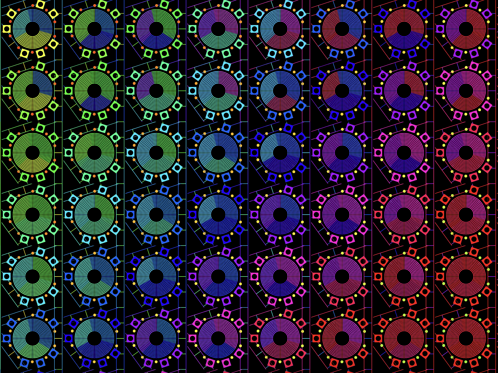

# quiz8
### Part 1: Imaging Technique Inspiration
Our group chose the work "Wheels of fortune" by the artist Pacita Abad for creation.

The work is composed of multiple circles, some of which have a line in the center. These lines remind me of the hands of a CD player. My inspiration came from visualizing these circles in the shape of a CD.

>This is the overall effect:
 

>This is what happens when each circle turns:

### Part 2: Coding Technique Exploration：
